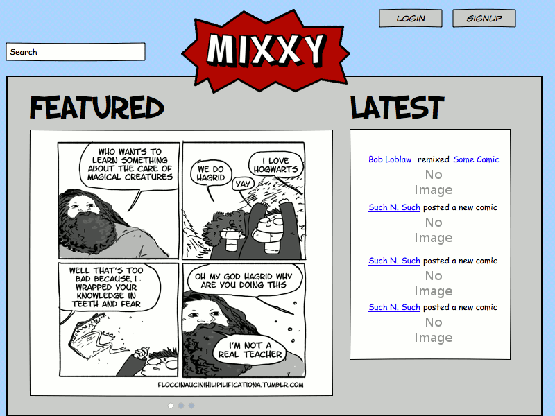
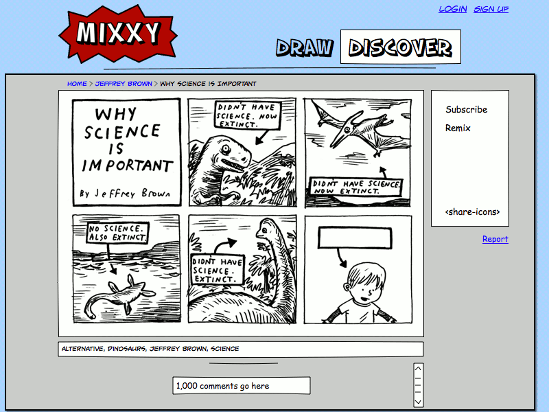
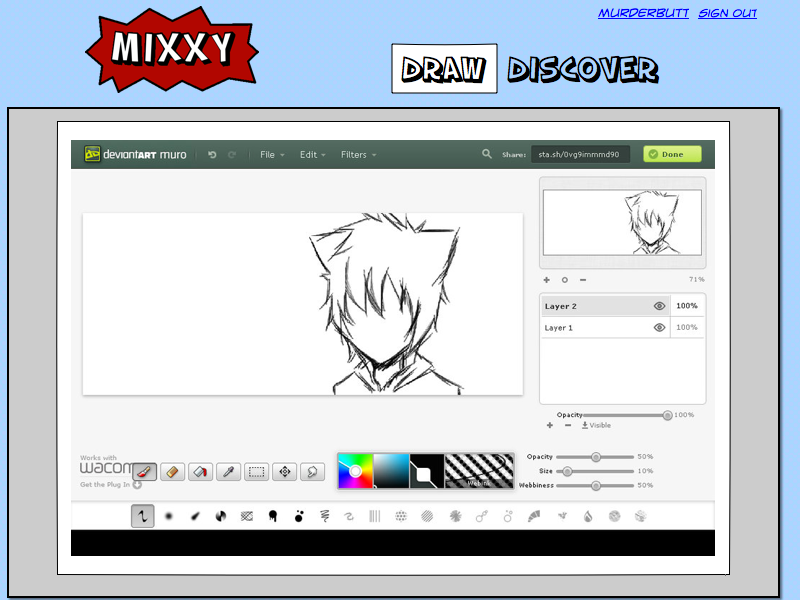
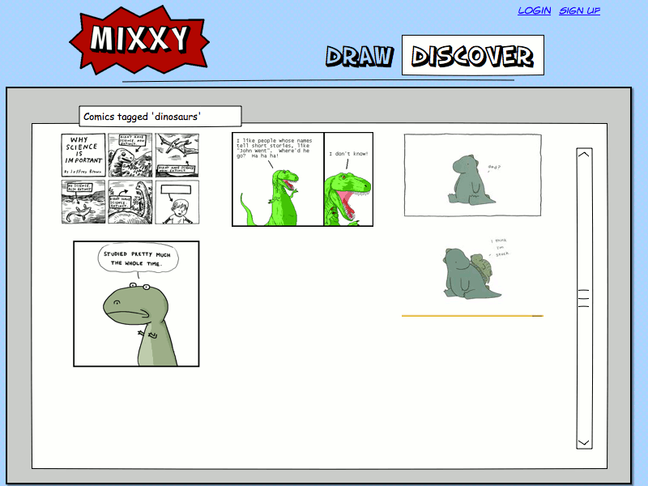
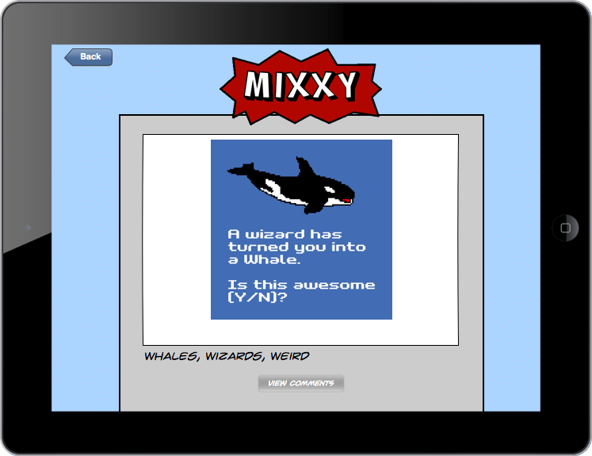

# Mixxy

Developed by www.purple, consisting of:

- Jesse Talavera-Greenberg
- Brian Sabzjadid
- Kathleen Cleary
- Cristiano Miranda

## Table of Contents

[ To be generated and provided in another pull request. ]

## Introduction

The purpose of this document is to specify our plans for the development of Mixxy, a Web-based collaborative art platform.  Specifically, we discuss the relevance of such a service, the functionality we see as required in order to declare Mixxy a fulfilling experience, and the challenges we expect to encounter in the development process.

We opted for a holistic approach in the creation of this document; we give preference to simplicity and conciseness over strict conformance to a standard, expecting that a reader will be able to parse and understand this document in its entirety.  We also expect that the reader is able and willing to contact us regarding clarifications, and that this document will be updated accordingly to reflect them.

### Scope

This document is written to specify the following of Mixxy:

- Description of Mixxy's potential user appeal
- High-level requirements and constraints
- Summary of mission-critical data
- Use cases

The following are *not* within the scope of this document:

- Detailed information about data storage requirements
- Specification of algorithms or functionality in a formal syntax
- A detailed analysis of the target audience
- Business plan and monetization details
- Architecture, software design, or other implementation issues
- Technology choices for non-critical components (e.g. utility libraries, parsers)

### Definitions

**Guest (n.):** A person who browses Mixxy without being signed in.  May include users who have not yet signed in.

**User (n.):** A person who registers for an account with Mixxy and partakes in its services.  Does not necessarily contribute content (but we'd like them to).

**Moderator (n.):** A user who enforces community standards through disciplinary action.

**Comment (n.):** A user's contribution to the discussion of a work.

**Comment (v.):** The act of a user contributing to the discussion of a work.

**Work (n.):** Any content posted to Mixxy, typically an illustration.

**Flag (v.):** The act of a user reporting to a moderator a work, comment, or user profile that violates community standards.

**Ban (n.):** A revocation of a user's ability to post works or otherwise contribute to Mixxy, typically for violating the terms of service.  May be temporary or permanent, depending on the severity of the offense.

**Ban (v.):** The act of a moderator awarding a ban on a user who has violated the terms of service.

**Remix (v.):** The act of one user making a copy of another's work for the purpose of editing, improving upon, or otherwise modifying the original work.

**Remix (n.):** The result of a user's modifications to a work.

*When remixing a work, the original is not modified in the process.  Remixing cannot be used for vandalism.*

**18+ (adj.):** Prominent depiction of any of the following themes:

  - Explicit sexual themes (e.g. nudity or pornography)
  - Realistic violence and gore
  - Excessive strong language
  - Extreme treatment of controversial topics

*18+ content is fully permitted, so long as it is categorized as such by its creator.*  May also be referred to informally as "mature", "adult", or "NSFW" (not safe for work).

**Forbidden (adj.):** Any presence of the following themes:

  - Child pornography, bestiality, rape, and other illegal sexual activity
  - Violations of copyright and privacy
  - Hateful speech, harassment, and cyber-bullying
  - Threats of violence or other disruptive activity
  - Encouragement of criminal activity
  - External links to any of the above

*Under no circumstances may forbidden content be posted.  Forbidden content and any remixes thereof will be forcibly removed, and if necessary the relevant authorities will be contacted.*

## Overall description

### Rationale

With the advent of social media, much of digital culture now revolves around freely sharing --- and occasionally modifying --- user-made content.  Mixxy is designed with this trend in mind, to empower artists and illustrators of all skills to put their own twist on an existing work.  How this is applied is left entirely to the user base --- community-built stories, collaborative works, and even outright parody come to mind, though by no means should they be seen as limits.  Clever and emergent uses of the platform are highly encouraged.

More formally, Mixxy is an art platform where users can not only post and share their own work, but freely remix that of others.  Users may provide or remix content with either the provided in-browser image editor or through their own preferred toolset, uploading their work to Mixxy upon its completion.  Users can discuss works with one another, follow creators they admire, or find works based on a particular subject matter.

Mixxy is *not* designed as:

- A platform to exchange works for monetary value
- A static art gallery or portfolio Web page
- A conventional image sharing service or imageboard (e.g. Imgur, 4chan)
- A recruiting service for artists
- A repository of artwork for use in other media (e.g. clip art websites, Open Game Art)
- A tutorial service for art and illustration skills

Users are, however, welcome to use Mixxy for these and other purposes unless otherwise stated.

### Use Cases

This section describes the ways in which users will interact with Mixxy.  Some use cases may be added, removed, or merged as development proceeds.  This UML diagram summarizes the following use cases, with more detailed information to follow:

[ UML diagram to provide in another pull request ]

#### Sign In
|                     Attribute | Details |
|-------------------------------|---------|
|                         Actor | Guest
|                          Goal | Authenticate a user and enable them to post works.
|                 Preconditions | User is not currently signed in.
|                       Trigger | Provide credentials to Mixxy.
|                         Steps | <ol><li>User starts the web application, which loads the homepage</li><li> User clicks on "Sign In" button</li></ol>|
|                    Exceptions | User may provide invalid credentials, or they may be banned.  In such a case, they are not signed in.
|                     Frequency | Frequent.  May be automated if the user's browser is configured as such.

#### Sign Out
|                     Attribute | Details |
|-------------------------------|---------|
|                         Actor | User
|                          Goal | End a user's session and all associated activity.
|                 Preconditions | User is signed in.
|                       Trigger | Click "Sign Out" button, or the session expires.
|                         Steps | <ol><li>User clicks on the "Sign Out" button</li></ol>
|                    Exceptions | If the user is not currently signed in, they will be shown an error.  No further action shall be taken.
|                     Frequency | Frequent.  May be automated if the user's browser is configured as such.

#### Draw Work
|                     Attribute | Details |
|-------------------------------|---------|
|                         Actor | User
|                          Goal | Provide users with a creative outlet.
|                 Preconditions | User is signed in.
|                       Trigger | Click "Draw Work" button.
|                         Steps | <ol><li>User clicks "Create New" button from Draw menu</li><li>Image editor loads in browser, allowing user to create a work</li><li>Image is displayed in browser, user can publish work</li></ol>
|                    Exceptions | Resulting work exceeds size limitations.  The user will be notified and the work will not be posted.
|                     Frequency | Moderate to Frequent

#### Upload Work
|                     Attribute | Details |
|-------------------------------|---------|
|                         Actor | User
|                          Goal | Allow users to create works with their preferred tools.
|                 Preconditions | User is signed in and able to upload work.
|                       Trigger | Click "Upload" button.
|                         Steps | <ol><li>User clicks upload button from Draw menu</li><li>File chooser loads, prompting actor to select file to be uploaded</li><li>Image is displayed in browser, allows actor confirm via button click to add image to profile or cancel to return to Draw menu</li></ol>       
|                    Exceptions | Uploaded work exceeds size limitations or is in an unknown file format.  The user will be notified and the work will not be posted.
|                     Frequency | Moderate to Frequent

#### Edit Work
|                     Attribute | Details |
|-------------------------------|---------|
|                         Actor | User, Moderator
|                          Goal | Revise or improve a user's own existing work.
|                 Preconditions | User is signed in and has previously posted works, or is a moderator.
|                       Trigger | Click "Edit" button when viewing a work.
|                         Steps | <ol><li>User navigates to work and selects "Edit"</li><li>Work is opened in editor</li><li>User edits work or its metadata (e.g. description).</li><li>User confirms or discards changes.  Changes are posted if confirmed.</li></ol>    
|                    Exceptions | Changes result in work exceeding size limitations.  The user will be notified and the work will not be updated.
|                     Frequency | Infrequently

#### Remix Work
|                     Attribute | Details |
|-------------------------------|---------|
|                         Actor | User
|                          Goal | Non-destructively improve upon or otherwise creatively modify existing works.
|                 Preconditions | User is signed in, and works available for remixing exist.
|                       Trigger | Click "Remix" button when viewing a work.
|                         Steps | <ol><li>User navigates to work and selects "Remix"</li><li>Work is copied to user's account</li>Remix is opened in editor</li><li>User edits remix</li><li>User confirms or discards remix.  Remix is posted if confirmed.</li></ol>   
|                    Exceptions | Remixed work exceeds size limitations or is in an unknown file format.  The user will be notified and the remix will not be posted.
|                     Frequency | Moderate to Frequent

#### Delete Work
|                     Attribute | Details |
|-------------------------------|---------|
|                         Actor | User, Moderator
|                          Goal | Remove a work that no longer represents a user's skill level, or remove a work that violates the terms of service.
|                 Preconditions | User is signed in and has previously posted a work, or is a moderator who is responding to a work that violates the terms of service.
|                       Trigger | Click "Delete" button when viewing a work.
|                         Steps | <ol><li>User navigates to work and selects "Delete"</li><li>User is prompted to confirm deletion</li><li>Work is deleted if user confirms their intention.</li><li>If a user deletes their own work, remixes will be preserved.</li><li>If a moderator deletes a work, they will have the option to delete all remixes.</li></ol>       
|                    Exceptions | None
|                     Frequency | Infrequently

#### Basic Search
|                     Attribute | Details |
|-------------------------------|---------|
|                         Actor | User
|                          Goal | Find one or more works given broad criteria.
|                 Preconditions | None
|                       Trigger | User enters a single text string as search criteria
|                         Steps | <ol><li>Enter text string in search field</li><li>Navigate through results</li><li>Navigate to any desired works that fit the criterion</li></ol>
|                    Exceptions | No works may fit the requested criteria.  The user will be notified of this.
|                     Frequency | Frequently

#### Advanced Search
|                     Attribute | Details |
|-------------------------------|---------|
|                         Actor | User
|                          Goal | Find one or more works given specific criteria.
|                 Preconditions | None
|                       Trigger | User navigates to the advanced search page
|                         Steps | <ol><li>Provide criteria based on authorship, popularity, age, and tags, among other thing</li><li>Navigate through results</li><li>Navigate to any desired works that fit the criterion</li></ol>
|                    Exceptions | No works may fit the requested criteria.  The user will be notified of this.
|                     Frequency | Frequently

#### Register
|                     Attribute | Details |
|-------------------------------|---------|
|                         Actor | Guest
|                          Goal | Grant a user access to Mixxy's functionality.
|                 Preconditions | User is not currently signed in.
|                       Trigger | User clicks on the "Register" button.
|                         Steps | <ol><li>User starts the web application, which loads the homepage</li><li> User clicks on the “Register” button</li></ol>
|                    Exceptions | User should be notified if he/she is already signed in.
|                     Frequency | Once

#### Tag Work
|                     Attribute | Details |
|-------------------------------|---------|
|                 Primary actor | User, Moderator
|                          Goal | Categorize a work based on its content for easy retrieval
|                 Preconditions | User is signed in and is posting a work, or is a moderator.
|                       Trigger | User creates, remixes, or edits a work.
|                         Steps | <ol><li>Enter delimited text strings that categorize the work</li><li>Finalize submission or update of work</li></ol>
|                    Exceptions | Certain tags may be reserved, or may only be used conditionally.  In such cases, the user may not post or update their work if their use of these tags is not permitted.
|                     Frequency | When creating or updating a work

#### Navigate to Similar Works
|                     Attribute | Details |
|-------------------------------|---------|
|                         Actor | Guest, User
|                          Goal | Find works with similar content that the user might enjoy.
|                 Preconditions | None
|                       Trigger | User navigates to related works near existing ones
|                         Steps | <ol><li>Given a small palette of similar works, navigate to any that are appealing.</li></ol>
|                    Exceptions | Not enough similar works may exist.  In practice, the definition of "similar" will be broadened, but in the early days there may be too few works.
|                     Frequency | Frequently

#### Ban User
|                     Attribute | Details |
|-------------------------------|---------|
|                         Actor | Moderator
|                          Goal | Enforce Mixxy's terms of service.
|                 Preconditions | The user being disciplined has violated the terms of service.
|                       Trigger | The admin clicks on a "ban/kick" button for a specific user.
|                         Steps | <ol><li>Admin starts the web application, which loads the homepage</li><li>Admin locates the user and clicks on the "ban" button</li></ol>
|                    Exceptions | None, barring human error.
|                     Frequency | Infrequently

#### Reset Password
|                     Attribute | Details |
|-------------------------------|---------|
|                         Actor | User
|                          Goal | Assist a user if they are unable to sign in.
|                 Preconditions | The user exists, but is not currently signed in or able to do so.
|                       Trigger | The user clicks on the "Forgot Password" button.
|                         Steps | <ol><li>User attempts to sign in.</li><li>User is unable to provide correct credentials.</li><li>User requests to reset password.</li><li>Recovery e-mail is sent to user's registered e-mail address.</li><li>User follows instructions in the given e-mail.</li><li>User regains access to their account and can now sign in.</li></ol>
|                    Exceptions | User may not receive the recovery e-mail.  They may request it be sent again.
|                     Frequency | Infrequently

#### Post Comment
|                     Attribute | Details |
|-------------------------------|---------|
|                         Actor | User
|                          Goal | Discuss a work with other users.
|                 Preconditions | User is signed in and viewing a work.
|                       Trigger | User navigates to comment section of work.
|                         Steps | <ol><li>Click on comment text field.</li><li>Write comment.</li><li>Submit comment.</li></ol>
|                    Exceptions | Comments may be disabled by the work's author.
|                     Frequency | Frequently

#### Upvote Comment
|                     Attribute | Details |
|-------------------------------|---------|
|                         Actor | User
|                          Goal | Highlight constructive discussions about a work.
|                 Preconditions | User is signed in and viewing a work.
|                       Trigger | User navigates to comment section of a work.
|                         Steps | <ol><li>Navigate to comment.</li><li>Click Upvote button.</li></ol>
|                    Exceptions | Comments may be disabled by the work's author.
|                     Frequency | Frequently

#### Downvote Comment
|                     Attribute | Details |
|-------------------------------|---------|
|                         Actor | User
|                          Goal | Denounce non-constructive discussions about a work.
|                 Preconditions | User is signed in and viewing a work.
|                       Trigger | User navigates to comment section of a work.
|                         Steps | <ol><li>Navigate to comment.</li><li>Click Down button.</li></ol>
|                    Exceptions | Comments may be disabled by the work's author.
|                     Frequency | Frequently

#### Flag Comment
|                     Attribute | Details | 
|-------------------------------|---------|
|                         Actor | User
|                          Goal | Flag a comment under a comic.
|                 Preconditions | User must be logged in, viewing a comic.
|                       Trigger | User navigates to comment section of comic.
|                         Steps | <ol><li>Navigate to comment.</li><li>Click Flag button.</li></ol>
|                    Exceptions | Comments disabled by comic's author.
|                     Frequency | At will.

#### Like Work
|                     Attribute | Details |
|-------------------------------|---------|
|                         Actor | User
|                          Goal | Express appreciation for a work.
|                 Preconditions | User must be signed in.
|                       Trigger | User navigates to a comic.
|                         Steps | <ol><li>Navigate to comic.</li><li>Click on Like button.</li></ol>
|                    Exceptions | User has already "Liked" a work
|                     Frequency | Frequently

#### Flag Work
|                     Attribute | Details |
|-------------------------------|---------|
|                         Actor | User
|                          Goal | Alert moderators to a violation of the terms of service.
|                 Preconditions | User must be logged in, viewing a commic.
|                       Trigger | User navigates to a comic.
|                         Steps | <ol><li>Navigate to comic.</li><li>Click on Flag button.</li></ol>
|                    Exceptions | Work has previously been flagged, but found to be compliant with terms of service.
|                     Frequency | Infrequently

#### Share Work
|                     Attribute | Details | 
|-------------------------------|---------|
|                         Actor | Guest, User
|                          Goal | Share comic on social networks other than Mixxy.
|                 Preconditions | User has social media accounts on other networks
|                       Trigger | User navigates to a comic.
|                         Steps | <ol><li>Navigate to comic.</li><li>Click on Share button.</li><li>Pick social network to share to.</li></ol>
|                    Exceptions | None
|                     Frequency | Frequently

### Mockups

This section proposes layouts and overall style for Mixxy.  These mockups are *descriptive*, not *prescriptive*; that is, they describe our suggested design for the frontend, but do not themselves specify how the final product will appear.  The functionality will be more or less unchanged, however.

#### Overall Page Flow

#### Main Page

#### Viewing a Work

#### Drawing

#### Search

#### Proposed Mobile Viewer

### Target Audience

Mixxy is designed primarily for the benefit of artists and their enthusiasts, with particular attention to the comic fanbase.  We expect that most potential users are young (typically ages 15-30) and reasonably tech-savvy.

Children under the age of 13 may not use Mixxy, because we do not have the resources to comply with the Children's Online Privacy Protection Act.

### Constraints

The following issues arose in the design of Mixxy, all of which affect our options as developers:

- Content will need some form of moderation, in order to prevent Mixxy from being associated with illegal or unsavory material (e.g. child pornography).
- We cannot allow children under the age of 13 to use Mixxy, as we are not prepared to comply with COPPA.
- For legal reasons, all user works posted on Mixxy must be released under a license that permits free distribution and modification.
- We have no budget to speak of.
- As we are constrained to Google App Engine and Java 7, we may not be able to use certain libraries and tools.
- Our use of DeviantArt Muro as an image editor tightly couples Mixxy to the service.
- The in-browser editor must support raster image editing.  This implies that user works must be stored in raster format, resulting in higher storage and bandwidth requirements.

### Assumptions and Dependencies

In designing Mixxy, we have assumed the following:

- Users will have a desktop or laptop computer
- Users will have a recent Web browser installed
  - Said browser will support modern Web standards such as HTML5, `<canvas>`, and the like.
- Users are comfortable with allowing other users to modify their work.
- Not all followers of a given user are themselves skilled artists.
- Users do not necessarily have accounts with other social platforms (e.g. DeviantArt).
- Users are vigilant enough to report any violation of Mixxy's code of conduct.

This document may require revision if any of the stated assumptions are violated.

## Specific Requirements

### External interfaces

Users will primarily access Mixxy and all of its functionality through our website on a desktop or laptop computer.  All functionality will be supported on mobile devices except for submitting, editing, and remixing works.  A RESTful API that allows developers to interface with Mixxy in any way they so choose is also planned, as is an iOS app to demonstrate this feature.

### Data Requirements

#### Users

Users will have associated with them the typical details of account registration (e-mail, password, moderator permissions, etc.).  Alongside this, users will have associated with them the works they submit or remix, as well as a list of other uses they follow or works they like.

#### Works

Works are images stored in raster format.  Associated with them are the user that authored it, all derived remixes, and the users who like this work.  Of note is that our DeviantArt Muro integration allows us to store most (but not all) images off-site, on DeviantArt's servers.  Works created by those without a DeviantArt account can be stored on our servers directly.
